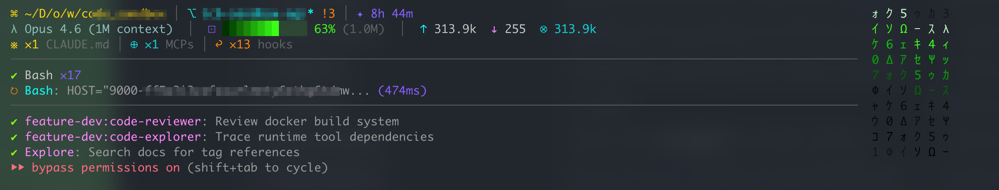

<div align="center">



# shannon-statusline

**赛博朋克终端 HUD for [Claude Code](https://claude.ai/code) — 7-line ANSI status, zero runtime deps, bridge-ready.**

[](https://www.npmjs.com/package/shannon-statusline)
[](./LICENSE)
[](./package.json)

</div>

挂载在 Claude Code 的 `PostToolUse` / `Stop` 生命周期钩子上，渲染一块多行 ANSI 状态条，集中展示模型、上下文用量、Git 状态、Token 消耗、工具活动、子 Agent 状态、Todo 进度。同时把全部数据写入一份 JSON Bridge 文件，供下游 GUI（如 [Shannon](https://github.com/RealAlexandreAI/Shannon)）消费。

---

## ⚡ 30 秒安装

```bash
npm install -g shannon-statusline
```

加到 `~/.claude/settings.json`：

```json
{
  "hooks": {
    "PostToolUse": [
      { "matcher": "", "hooks": [{ "type": "command", "command": "shannon-statusline" }] }
    ],
    "Stop": [
      { "matcher": "", "hooks": [{ "type": "command", "command": "shannon-statusline" }] }
    ]
  }
}
```

完成。下次 Claude Code 调用任意工具或停止时，HUD 自动渲染。

<details>
<summary>🤖 想让 AI Agent 全自动安装？点这里展开 install script</summary>

```agent-install
# Step 1: Install shannon-statusline globally
npm install -g shannon-statusline

# Step 2: Merge hooks into ~/.claude/settings.json (deep-merge, won't clobber existing hooks)
SETTINGS_FILE="$HOME/.claude/settings.json"
mkdir -p "$(dirname "$SETTINGS_FILE")"
[ ! -f "$SETTINGS_FILE" ] && echo '{}' > "$SETTINGS_FILE"

node - <<'EOF'
const fs = require('fs');
const path = require('path');
const file = path.join(process.env.HOME, '.claude', 'settings.json');
let config = {};
try { config = JSON.parse(fs.readFileSync(file, 'utf8')); } catch {}
config.hooks ??= {};
const hookEntry = { type: 'command', command: 'shannon-statusline' };
const matcher   = { matcher: '', hooks: [hookEntry] };
for (const event of ['PostToolUse', 'Stop']) {
  config.hooks[event] ??= [];
  const already = config.hooks[event].some(g => g.hooks?.some(h => h.command === 'shannon-statusline'));
  if (!already) config.hooks[event].push(matcher);
}
fs.writeFileSync(file, JSON.stringify(config, null, 2));
console.log('✔ shannon-statusline hooks installed →', file);
EOF

# Step 3: Verify
shannon-statusline --version 2>/dev/null && echo "✔ binary OK" || echo "⚠ binary not found — check PATH"
```

</details>

<details>
<summary>项目级 hook（只在某个仓库启用）</summary>

加到项目根目录 `.claude/settings.json`：

```json
{
  "hooks": {
    "PostToolUse": [
      { "matcher": "", "hooks": [{ "type": "command", "command": "shannon-statusline" }] }
    ]
  }
}
```

</details>

---

## ✨ 它做什么

| | |
|---|---|
| 🪶 **Zero runtime deps** | `dependencies: {}`，唯一依赖是 Node.js 自带 stdlib |
| ⚡ **快** | 整个渲染管线 < 50ms（实测中位数），包括 transcript 解析、git status、配置文件扫描 |
| 🎨 **不用 Nerd Font** | 全部图标走标准 Unicode 块（Greek、Arrows、Math Ops、Misc Technical），SF Mono / Menlo / Monaco 即可正常显示 |
| 🌉 **Bridge 就绪** | 同时把结构化数据写到 JSON 文件，供 GUI 消费（[Shannon](https://github.com/RealAlexandreAI/Shannon) 是当前唯一已知消费者） |
| 🔬 **解析丰富** | JSONL transcript 提取工具调用 / 子 Agent / Todo / 文件活动；`git status -b` 拿分支 / dirty / ahead / behind / file stats；扫 CLAUDE.md / rules / MCP / hooks 配置数 |
| 🌈 **真彩色** | 上下文进度条按用量在暗绿 → 霓虹酸绿 → 霓虹橙 → 霓虹粉之间渐变，超 85% 触发 `▲ high usage` 警告 |

---

## 🖥 HUD 长什么样

```
λ claude-opus-4-5 │ ⌘ ~/D/Shannon │ ⎇ main* ↑2 !3 +1 │ ✦ 12m │ @myagent │ ⊟ auto
⊡ ████████░░░░ 65% (200k)  ↑ 36k  ↓ 300  ⊗ 8.5k
※ ×3 CLAUDE.md │ ≡ ×2 rules │ ⊕ ×1 MCPs │ ↩ ×2 hooks
────────────────────────────────────────
↻ Bash: ~/D/Shannon/src (3s) │ ✔ Read ×12 │ ✔ Edit ×7 │ ✔ Bash ×4
↻ Task [claude-haiku-3-5]: implement auth module (1m 2s)
▸ Fix login bug (3/5)
```

7 行 / 两区：

- **状态区**（上 3 行 + 分隔线）—— 项目信息、上下文用量、配置加载
- **活动区**（下 3 行）—— 工具活动、子 Agent 活动、Todo 进度

<details>
<summary>第 1 行 · 项目信息（点开看每个图标含义）</summary>

| 图标 | 含义 | 颜色 |
|------|------|------|
| `λ` | Claude 模型名 | electric cyan |
| `⌘` | 工作目录（Fish 风格缩短路径） | chrome gold |
| `⎇` | Git 分支 `*`=有未提交修改 | electric cyan |
| `↑N` | 领先远端 N 个提交 | green |
| `↓N` | 落后远端 N 个提交 | red |
| `!N` | 已修改文件数 | neon orange |
| `+N` | 新增文件数 | matrix green |
| `✘N` | 已删除文件数 | red |
| `?N` | Untracked 文件数 | electric purple |
| `✦` | 会话时长 | electric purple |
| `@name` | Agent 名称 | neon pink |
| `⊟` | 权限模式（auto/approve-all/deny-all） | electric purple |

</details>

<details>
<summary>第 2 行 · 上下文用量（含真彩色进度条规则）</summary>

行格式：`⊡ ████░░ 65% (200k)  ↑ 36k  ↓ 300  ⊗ 8.5k`

| 范围 | 颜色渐变 | 含义 |
|------|---------|------|
| < 70% | 暗绿 → 霓虹酸绿 `#39ff14` | 正常 |
| 70–84% | 暗焦橙 → 霓虹橙 `#ff6b00` | 注意 |
| ≥ 85% | 深洋红 → 霓虹粉 `#ff0090` | 危险 + `▲ high usage` 警告 |

| 图标 | 含义 |
|------|------|
| `⊡` | 上下文进度条 |
| `↑` | Input tokens |
| `↓` | Output tokens |
| `⊗` | 缓存命中 tokens（cache_read + cache_creation） |

</details>

<details>
<summary>第 3 行 · 配置加载</summary>

| 图标 | 含义 | 颜色 |
|------|------|------|
| `※` | 加载的 `CLAUDE.md` 数量 | chrome gold |
| `≡` | Rules 文件数量 | electric purple |
| `⊕` | MCP 数量 | bright aqua |
| `↩` | Hooks 数量 | neon orange |

如果全部为 0 则此行不显示。

</details>

<details>
<summary>第 5–7 行 · 活动区</summary>

**第 5 行 · 工具活动** —— 运行中的工具（最近 3 个）+ 完成工具统计（按频率排序，最多 5 项）：

```
↻ Bash: ~/D/Shannon/src (3s) │ ✔ Read ×12 │ ✔ Edit ×7
```

| 图标 | 含义 | 颜色 |
|------|------|------|
| `↻` | 正在运行 | neon orange |
| `✔` | 已完成 | matrix green |

**第 6 行 · Agent 活动** —— 运行中的子 Agent（最近 3 个）+ 已完成 Agent（最近 3 个）：

```
↻ Task [claude-haiku-3-5]: implement feature (1m 2s) │ ✔ Task: debug session
```

**第 7 行 · Todo 进度**：

```
▸ Fix login bug (3/5)       # 有进行中 todo
✔ All done (5/5)            # 全部完成
```

</details>

<details>
<summary>图标速查表</summary>

| 图标 | Unicode | 用途 |
|------|---------|------|
| `λ` | U+03BB | AI / Claude 模型（λ演算） |
| `⌘` | U+2318 | 工作目录路径（macOS ⌘ 键） |
| `⎇` | U+2387 | Git 分支 |
| `✦` | U+2726 | 会话时长 |
| `⊟` | U+229F | 权限模式 |
| `↑` | U+2191 | Input tokens / Git 领先 |
| `↓` | U+2193 | Output tokens / Git 落后 |
| `⊗` | U+2297 | 缓存 tokens |
| `⊡` | U+22A1 | 上下文进度条 |
| `≡` | U+2261 | Rules 文件 |
| `⊕` | U+2295 | MCP 数量 |
| `▲` | U+25B2 | 高用量警告 |
| `✔` | U+2714 | 已完成 |
| `↻` | U+21BB | 运行中 |
| `▸` | U+25B8 | 当前 Todo |
| `※` | U+203B | CLAUDE.md 配置文件 |
| `↩` | U+21A9 | Hooks（事件触发器） |

> 全部来自标准 Unicode 块，**不需要 Nerd Font**。

</details>

---

## 🌉 Bridge JSON

每次渲染完，statusline 会把同一帧数据序列化成 JSON 写到一个文件：

```bash
# 默认路径（macOS）
~/Library/Caches/shannon/status.json

# 覆盖
SHANNON_BRIDGE_PATH=/tmp/my-bridge.json shannon-statusline
```

| 环境变量 | 默认 | 说明 |
|---------|------|------|
| `SHANNON_BRIDGE_PATH` | `~/Library/Caches/shannon/status.json`（macOS） | Bridge JSON 输出路径 |

<details>
<summary>完整 schema（点开看字段定义）</summary>

```json
{
  "session_id": "abc123",
  "model": { "id": "claude-opus-4-5", "display_name": "claude-opus-4-5" },
  "context_window": {
    "used_percentage": 65,
    "remaining_percentage": 35,
    "context_window_size": 200000,
    "input_tokens": 36000,
    "output_tokens": 300,
    "cache_creation_input_tokens": 0,
    "cache_read_input_tokens": 8500
  },
  "cost": {
    "total_cost_usd": 0.042,
    "total_duration_ms": 12000,
    "total_lines_added": 45,
    "total_lines_removed": 12
  },
  "workspace": {
    "cwd": "/Users/slahser/Desktop/Shannon",
    "project_dir": "/Users/slahser/Desktop/Shannon"
  },
  "git": {
    "branch": "main",
    "is_dirty": true,
    "ahead": 2,
    "behind": 0,
    "file_stats": { "modified": 3, "added": 1, "deleted": 0, "untracked": 2 }
  },
  "tools": [
    {
      "name": "Read",
      "target": "/src/index.ts",
      "status": "completed",
      "start_time_ms": 1700000000000,
      "duration_ms": 45
    }
  ],
  "tool_counts": { "Read": 12, "Edit": 7, "Bash": 4 },
  "agents": [
    {
      "id": "agent-001",
      "type": "Task",
      "model": "claude-haiku-3-5",
      "description": "implement auth module",
      "status": "running",
      "start_time_ms": 1700000000000,
      "duration_ms": null
    }
  ],
  "todos": [
    { "content": "Fix login bug", "status": "in_progress", "priority": "high" }
  ],
  "file_activity": [
    { "path": "/src/index.ts", "type": "write", "timestamp_ms": 1700000000000 }
  ],
  "config_counts": {
    "claude_md": 3,
    "rules": 2,
    "mcp": 1,
    "hooks": 2
  },
  "session_duration_ms": 720000,
  "permission_mode": "auto",
  "vim_mode": null,
  "agent_name": null,
  "timestamp": 1700000000000
}
```

> Schema 是公开契约。修改字段需 bump 版本，规则见 [`CONTRIBUTING.md`](./CONTRIBUTING.md#bridge-json-schema-变更政策)。

</details>

---

## 工作原理

Claude Code 触发 hook 时，通过 stdin 把 JSON payload 传给 `shannon-statusline`：

1. **解析** payload —— model / context window / session ID / transcript path / cwd
2. **并行收集** 三路数据
   - **Transcript** —— 解析最近 JSONL 文件，统计工具 / 子 Agent / Todo / 文件活动
   - **Git** —— `git status --porcelain -b` 拿分支、dirty、ahead/behind、文件统计
   - **Configs** —— 扫描 `CLAUDE.md` / rules / MCP / hooks 文件数
3. **渲染** 7 行 ANSI HUD 到 stdout（所有空格替换为 NBSP，防止终端折行）
4. **写入** Bridge JSON 文件，供 GUI 消费

---

## Shannon GUI 集成

[Shannon](https://github.com/RealAlexandreAI/Shannon) 是一个 macOS Tauri app，监听 Bridge 文件 + 通过 Unix socket 接收 NDJSON 流，把数据实时渲染到侧边栏 **Agent Status** 面板：模型、上下文进度条、工具统计、文件活动 timeline、子 Agent 列表、Todo 进度。

无需额外配置。Shannon 会从默认路径（`~/Library/Caches/shannon/status.json`）读取，或通过环境变量覆盖。

> Shannon 是私有 repo，statusline 是独立公开 npm 包。两者通过 Bridge JSON 这一公开契约解耦，互不依赖对方源码。

---

## 开发 / 贡献 / 发版

- 开发指南、项目结构、代码风格、与 Shannon GUI 的端到端验证：[`CONTRIBUTING.md`](./CONTRIBUTING.md)
- 发版 SOP（semver / git tag / 手动 `npm publish`）：[`RELEASING.md`](./RELEASING.md)

Issues 和 PR 提到 [github.com/RealAlexandreAI/shannon-statusline](https://github.com/RealAlexandreAI/shannon-statusline)。

```bash
git clone https://github.com/RealAlexandreAI/shannon-statusline.git
cd shannon-statusline
bun install
bun run build         # TypeScript → dist/
bun run test:stdin    # 用示例 payload 跑通管线
```

---

## License

[MIT](./LICENSE)
